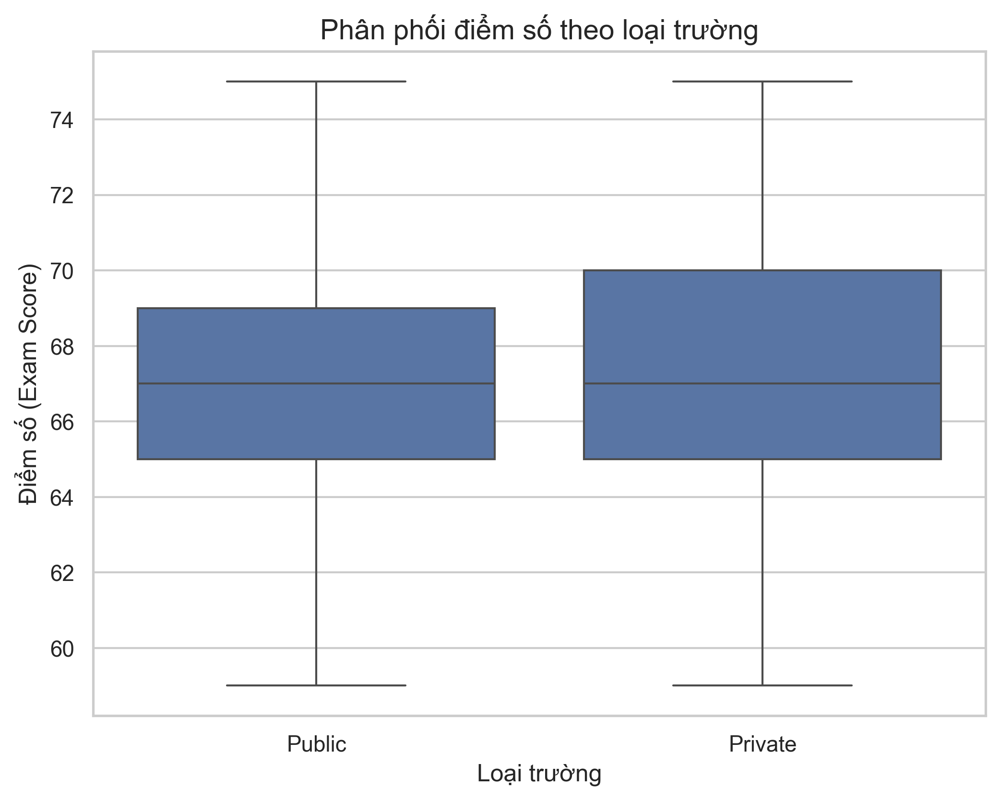
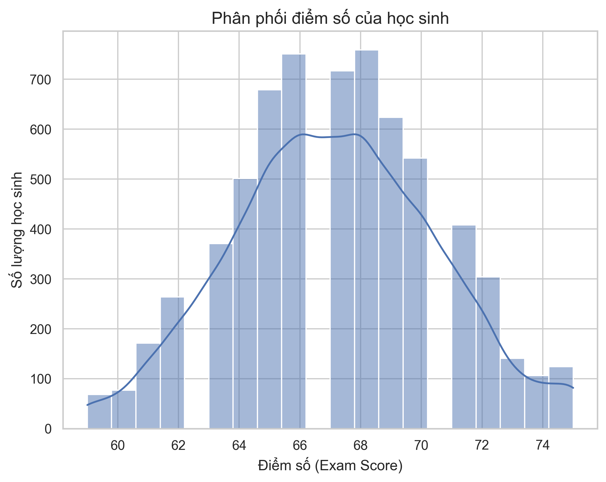
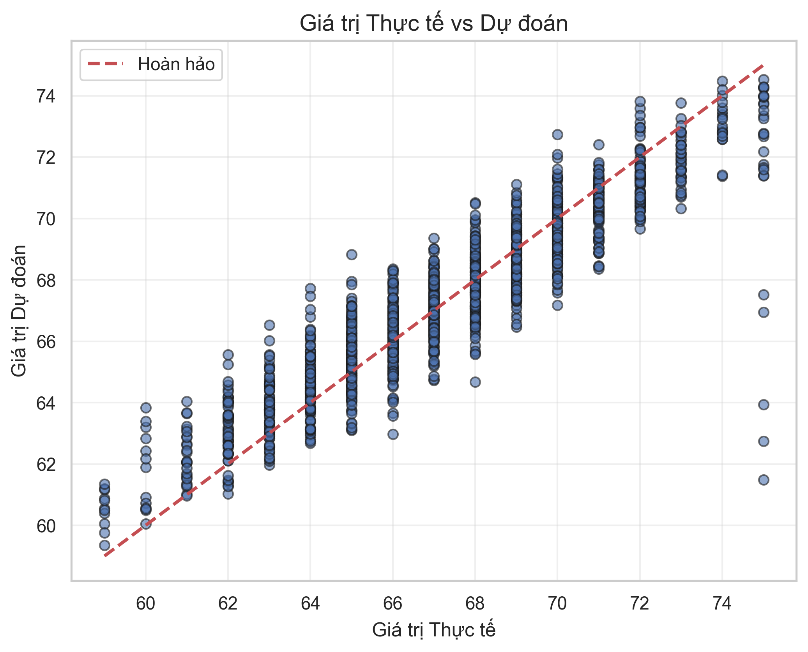
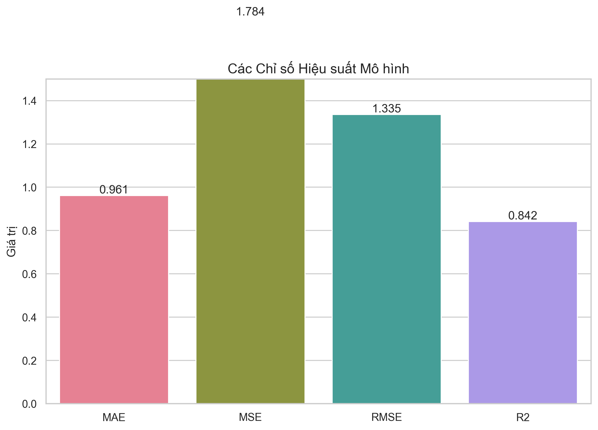

##  Student Exam Analysis

###  Giới thiệu

Student Exam Analysis là một project Python dùng để phân tích dữ liệu kết quả học tập của sinh viên.
Dự án giúp xử lý dữ liệu thô, trực quan hóa và rút ra insight về các yếu tố ảnh hưởng đến điểm số.

###  Tính năng chính
- Đọc dữ liệu từ file CSV
- Làm sạch dữ liệu (missing values, duplicates, format)
- Phân tích thống kê cơ bản
- Trực quan hóa dữ liệu (biểu đồ)
- Tìm mối quan hệ giữa các yếu tố và kết quả thi
---
### Cấu trúc project
```
StudentExamAnalysis/
│── data/
│   ├── raw/                     # Dữ liệu gốc
│   └── processed/              # Dữ liệu sau khi xử lý
│
│── scripts/
│   ├── clean_data.py           # Làm sạch dữ liệu
│   ├── analyze_data.py         # Phân tích dữ liệu
│   └── visualize.py            # Vẽ biểu đồ
│
│── outputs/                    # Kết quả (ảnh, báo cáo)
│
│── main.py                     # Chạy project
│── requirements.txt            # Thư viện cần thiết
│── README.md                   # Tài liệu project
```
---
### Cài đặt
1. Clone repo
```bash
git clone https://github.com/Dtuan2624/StudentExamAnalysis.git
cd StudentExamAnalysis
```
2. Tạo virtual environment
```bash
python -m venv .venv
```
3. Kích hoạt môi trường

- Windows:
```
.venv\Scripts\activate
```
- Mac/Linux:
```
source .venv/bin/activate
```
4. Cài thư viện
```bash
pip install -r requirements.txt
```
---
### Cách sử dụng
cmd
```aiignore
 python main.py
```
---
### Dataset
1. File dữ liệu nằm tại:
- data/raw/StudentPerformanceFactors.csv
2. Dữ liệu bao gồm:
- Hours Studied
- Attendance
- Sleep Hours
- Previous Scores
- Exam Score
- ...
3. Tình hình dữ liệu :
-
---
### Output
- Các biểu đồ phân tích (figure/eda)



- Các biểu đồ dự đoán (figure/evaluation)


---
### Ngôn ngữ sử dụng / Thư viện sử dụng 
- Python 
- Pandas
- NumPy
- Matplotlib / Seaborn
---
