# 📚 Student Exam Performance Analysis & Prediction

> **Chuyên đề tốt nghiệp 3 — Nhóm 13**  
> Phân tích các yếu tố ảnh hưởng và dự đoán kết quả học tập của học sinh bằng Machine Learning

---

## 📌 Giới thiệu

**Student Exam Performance Analysis** là một dự án Khoa học Dữ liệu toàn diện được xây dựng bằng Python, nhằm mục đích:

- **Phân tích đa chiều** các yếu tố gia đình, nhà trường, và hành vi cá nhân ảnh hưởng đến kết quả thi cuối kỳ của học sinh.
- **Xây dựng mô hình học máy** (Random Forest Regressor) để dự báo điểm thi với độ chính xác cao.
- **Trực quan hóa dữ liệu** thông qua các biểu đồ thống kê phong phú và giao diện web tương tác bằng Streamlit.

Dự án giúp nhà trường, giáo viên và gia đình phát hiện sớm các nguy cơ học tập sa sút để can thiệp và hỗ trợ học sinh kịp thời.

---

## ✨ Tính năng chính

| Tính năng | Mô tả |
|---|---|
| 🧹 Làm sạch dữ liệu | Xử lý missing values, duplicates, outliers bằng Quantile Clipping |
| 📊 Phân tích khám phá (EDA) | Vẽ 9+ loại biểu đồ phân tích đa chiều |
| 🔗 Phân tích tương quan | Ma trận tương quan Pearson giữa tất cả các biến số |
| 🤖 Mô hình dự đoán | Random Forest Regressor với 5-Fold Cross-Validation |
| 🎯 Mã hóa nhãn thông minh | Ordinal Encoding bảo toàn thứ tự bậc (Low < Medium < High) |
| 📈 Đánh giá mô hình | Biểu đồ Residuals, Actual vs Predicted, Feature Importance |
| 🖥️ Giao diện web | Ứng dụng Streamlit tương tác với đầy đủ 19 đặc trưng dự đoán |

---

## 🗂️ Cấu trúc Project

```
StudentExamAnalysis/
│
├── data/
│   ├── raw/
│   │   └── StudentPerformanceFactors.csv     # Dữ liệu gốc thô
│   └── processed/
│       └── StudentPerformance_cleaned.csv    # Dữ liệu sau làm sạch
│
├── src/
│   ├── __init__.py
│   ├── clean_data.py      # Làm sạch & tiền xử lý dữ liệu
│   ├── load_data.py       # Đọc dữ liệu
│   ├── model.py           # Huấn luyện, dự đoán & lưu mô hình
│   └── visualize.py       # Vẽ tất cả các biểu đồ
│
├── models/
│   ├── student_performance_model.pkl   # Mô hình Random Forest đã huấn luyện
│   ├── label_encoders.pkl              # Bộ mã hóa nhãn (Ordinal Maps)
│   └── feature_names.pkl              # Tên các đặc trưng đầu vào
│
├── figure/
│   ├── eda/                           # Biểu đồ phân tích EDA
│   └── evaluation/                    # Biểu đồ đánh giá mô hình
│
├── document/
│   └── nhom_13_chuyendetotnghiep3.docx  # Báo cáo Word
│
├── main.py               # Chạy toàn bộ pipeline (Cleaning → EDA → Training)
├── streamlit_app.py      # Giao diện web tương tác
├── requirements.txt      # Danh sách thư viện cần thiết
└── README.md             # Tài liệu hướng dẫn
```

---

## 📦 Cài đặt

### Bước 1: Clone repository

```bash
git clone https://github.com/Dtuan2624/StudentExamAnalysis.git
cd StudentExamAnalysis
```

### Bước 2: Tạo môi trường ảo (Virtual Environment)

```bash
python -m venv .venv
```

### Bước 3: Kích hoạt môi trường

- **Windows:**
  ```bash
  .venv\Scripts\activate
  ```
- **Mac / Linux:**
  ```bash
  source .venv/bin/activate
  ```

### Bước 4: Cài đặt các thư viện

```bash
pip install -r requirements.txt
```

---

## 🚀 Cách sử dụng

### 1. Chạy toàn bộ pipeline (Làm sạch dữ liệu → Phân tích → Huấn luyện mô hình)

```bash
python main.py
```

Lệnh này sẽ tự động thực hiện tuần tự:
1. Làm sạch dữ liệu thô và lưu vào `data/processed/`
2. Vẽ toàn bộ biểu đồ EDA và lưu vào `figure/eda/`
3. Huấn luyện mô hình Random Forest và lưu vào `models/`
4. Đánh giá mô hình và lưu biểu đồ vào `figure/evaluation/`

### 2. Khởi chạy giao diện web tương tác (Streamlit)

```bash
streamlit run streamlit_app.py
```

Sau đó mở trình duyệt tại địa chỉ: `http://localhost:8501`

---

## 📂 Dataset

**Nguồn:** `data/raw/StudentPerformanceFactors.csv`

| # | Tên cột | Kiểu dữ liệu | Mô tả |
|---|---|---|---|
| 1 | `Hours_Studied` | Số nguyên | Giờ tự học mỗi tuần |
| 2 | `Attendance` | Số nguyên | Tỷ lệ điểm danh (%) |
| 3 | `Parental_Involvement` | Phân loại | Sự quan tâm của phụ huynh (Low/Medium/High) |
| 4 | `Access_to_Resources` | Phân loại | Mức độ tiếp cận tài nguyên học tập |
| 5 | `Extracurricular_Activities` | Phân loại | Tham gia hoạt động ngoại khóa (Yes/No) |
| 6 | `Sleep_Hours` | Số nguyên | Số giờ ngủ mỗi ngày |
| 7 | `Previous_Scores` | Số nguyên | Điểm các bài kiểm tra trước |
| 8 | `Motivation_Level` | Phân loại | Mức độ động lực học tập (Low/Medium/High) |
| 9 | `Internet_Access` | Phân loại | Có truy cập Internet không (Yes/No) |
| 10 | `Tutoring_Sessions` | Số nguyên | Số buổi học thêm/gia sư mỗi tháng |
| 11 | `Family_Income` | Phân loại | Mức thu nhập gia đình (Low/Medium/High) |
| 12 | `Teacher_Quality` | Phân loại | Đánh giá chất lượng giáo viên |
| 13 | `School_Type` | Phân loại | Loại trường (Public/Private) |
| 14 | `Peer_Influence` | Phân loại | Ảnh hưởng từ bạn bè (Positive/Neutral/Negative) |
| 15 | `Physical_Activity` | Số nguyên | Giờ tập thể dục mỗi tuần |
| 16 | `Learning_Disabilities` | Phân loại | Có khuyết tật học tập không (Yes/No) |
| 17 | `Parental_Education_Level` | Phân loại | Trình độ học vấn của phụ huynh |
| 18 | `Distance_from_Home` | Phân loại | Khoảng cách từ nhà đến trường (Near/Moderate/Far) |
| 19 | `Gender` | Phân loại | Giới tính (Male/Female) |
| 20 | `Exam_Score` ⭐ | Số nguyên | **Biến mục tiêu — Điểm thi cuối kỳ** |

> **Thông tin tập dữ liệu:** 6,607 mẫu học sinh · 20 đặc trưng · Không có giá trị trùng lặp

---

## 📊 Kết quả & Biểu đồ

### 🔍 Phân tích khám phá dữ liệu (EDA)

| Biểu đồ | Hình ảnh |
|---|---|
| Phân phối điểm thi | 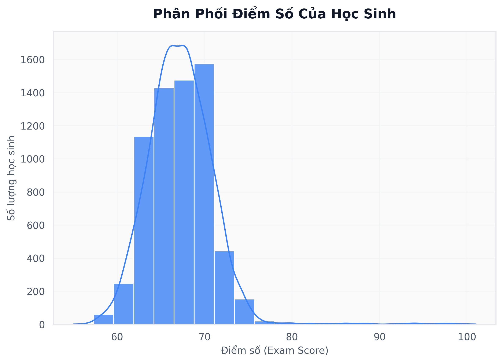 |
| Thời gian học vs Điểm số | 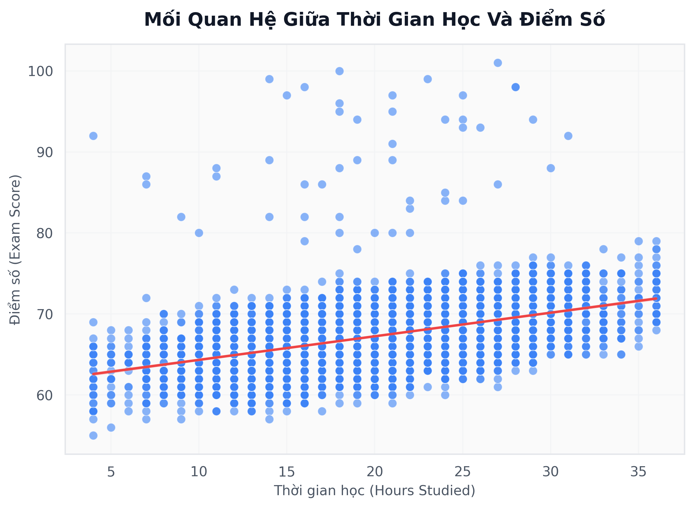 |
| Điểm danh vs Điểm số | 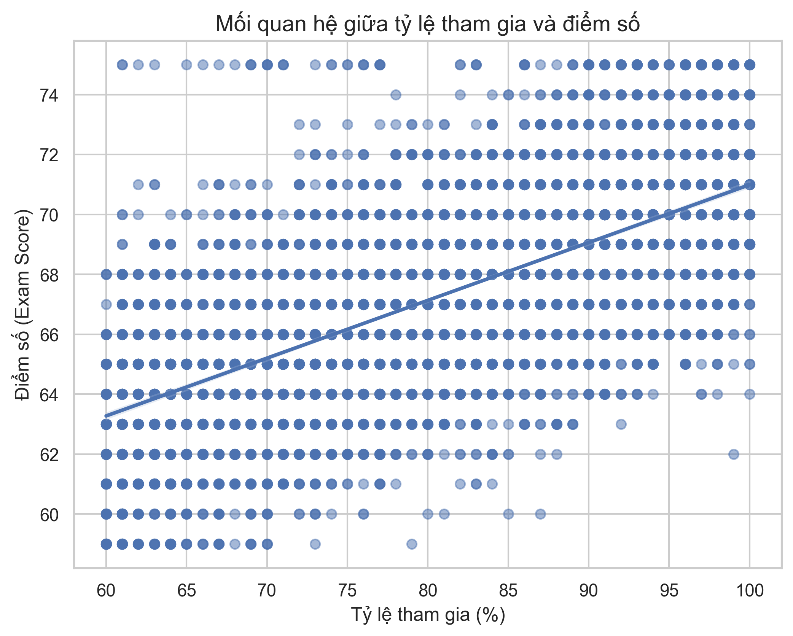 |
| Phân phối điểm theo giới tính | 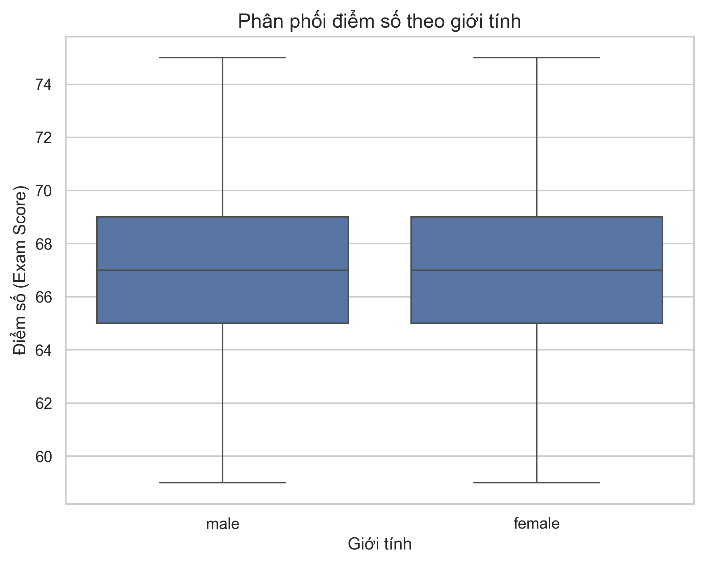 |
| Phân phối điểm theo loại trường | 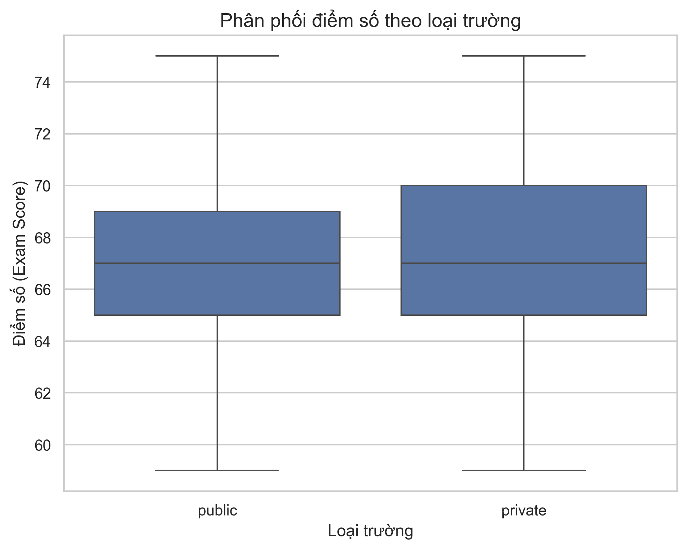 |
| Điểm TB theo sự tham gia phụ huynh | 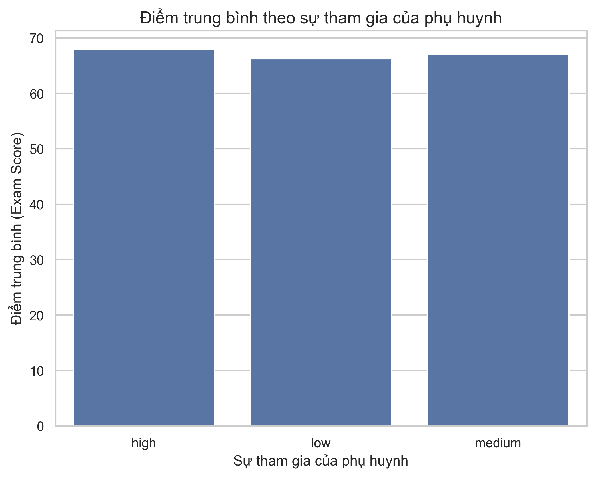 |
| Phân phối mức độ động lực | 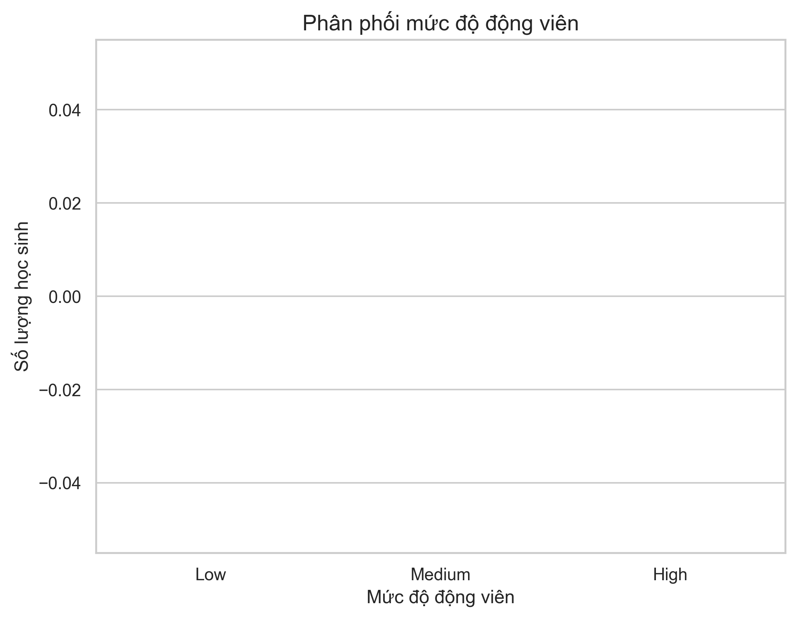 |
| Ma trận tương quan Pearson | 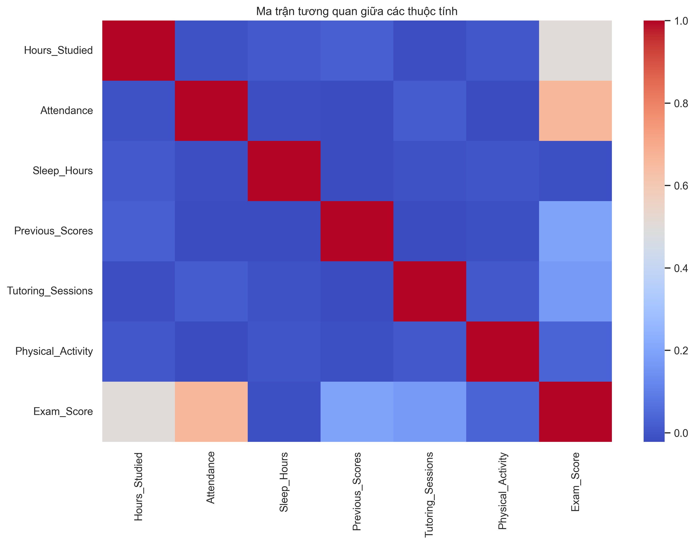 |

### 📈 Đánh giá hiệu năng mô hình

| Biểu đồ | Hình ảnh |
|---|---|
| Thực tế vs Dự đoán | 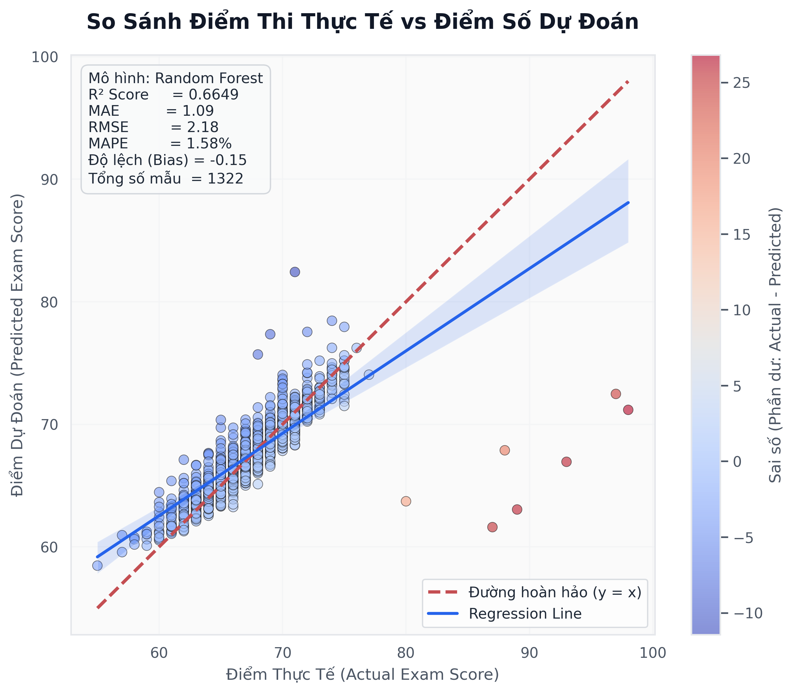 |
| Mức độ quan trọng đặc trưng | 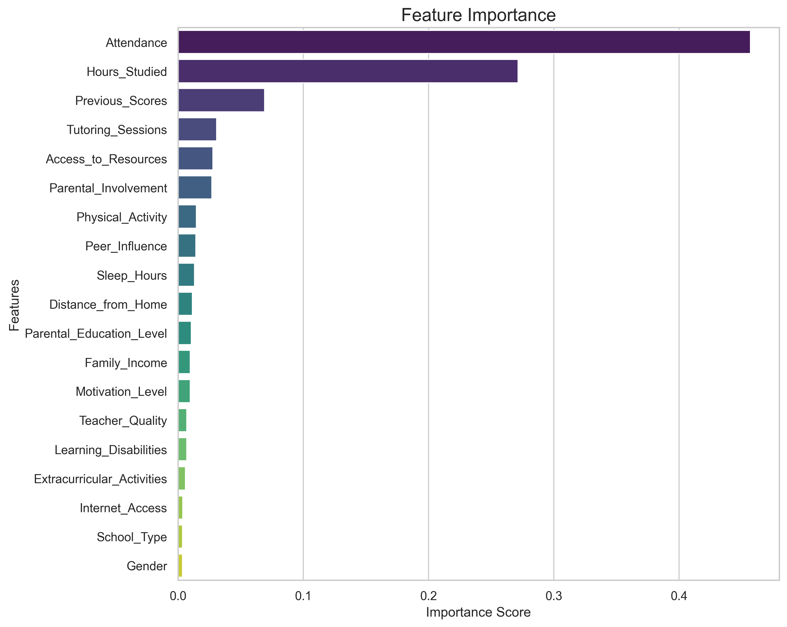 |
| Phân phối sai số dự đoán | 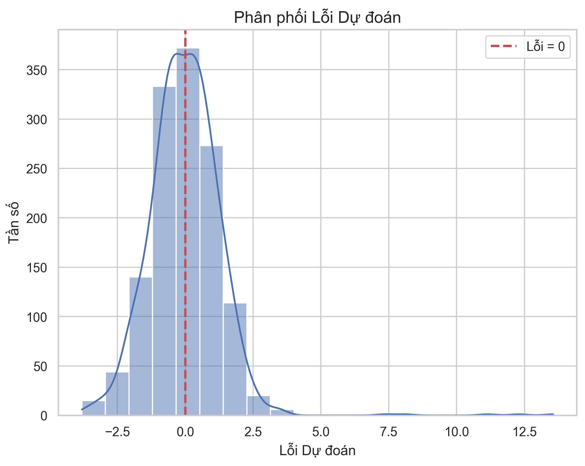 |
| Biểu đồ phần dư (Residuals) | 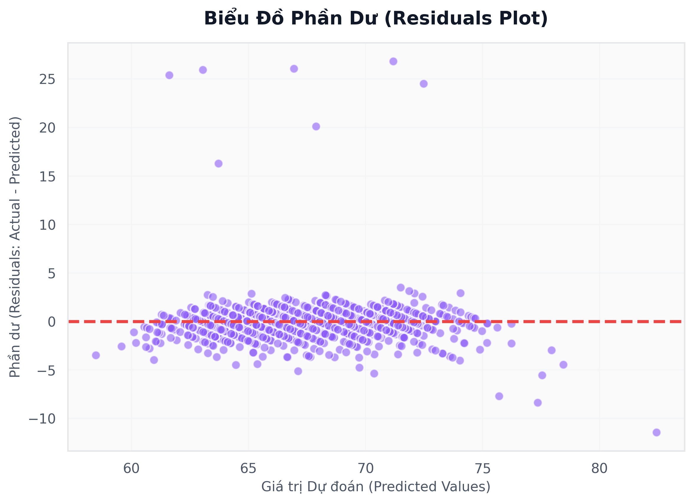 |
| Kết quả Cross-Validation | 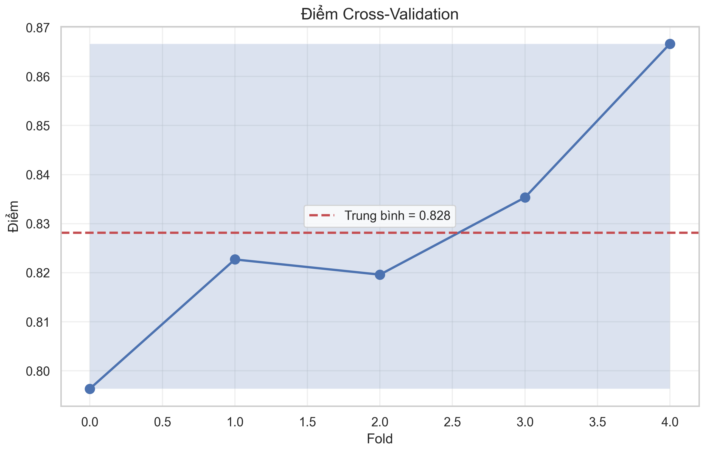 |

---


## 🛠️ Công nghệ sử dụng

| Thư viện | Phiên bản | Mục đích |
|---|---|---|
| `Python` | 3.10+ | Ngôn ngữ lập trình chính |
| `Pandas` | ≥ 2.0.0 | Xử lý và phân tích dữ liệu |
| `NumPy` | ≥ 1.24.0 | Tính toán số học |
| `Scikit-Learn` | ≥ 1.3.0 | Mô hình học máy |
| `Matplotlib` | ≥ 3.7.0 | Vẽ biểu đồ |
| `Seaborn` | ≥ 0.12.0 | Trực quan hóa thống kê |
| `Streamlit` | ≥ 1.30.0 | Giao diện web tương tác |
| `Joblib` | ≥ 1.3.0 | Lưu và tải mô hình |

---

## 👨‍👩‍👦 Thông tin nhóm

**Nhóm 13 — Chuyên đề tốt nghiệp 3**  
Trường Đại học Công Nghệ Đông Á / Khoa Công nghệ Thông tin

---

<p align="center">
  Made with ❤️ by Nhóm 13
</p>
